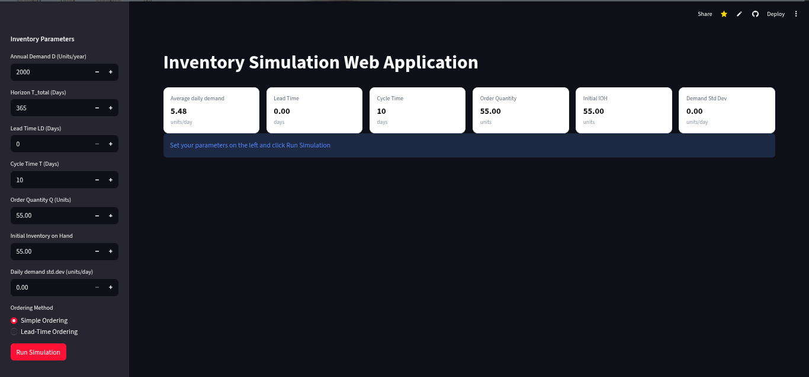
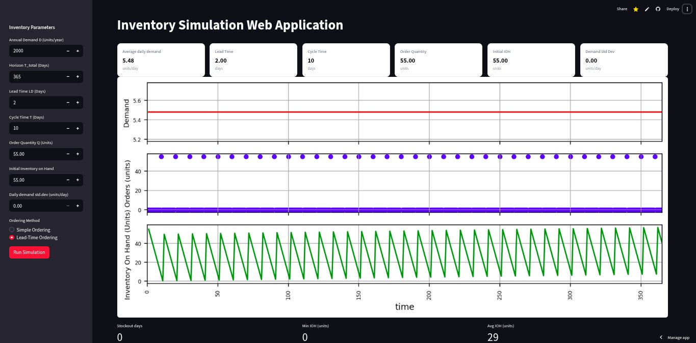

# Inventory Simulation — Streamlit Web App

Turn a Python inventory simulation into a **single-page web app** your team can use.  
The app lets you test **fixed-cycle replenishment** under deterministic and stochastic demand, visualize **Demand / Orders / IOH**, and compare simple vs **lead-time-aware** ordering.

- Click **Run simulation** once; after that, any parameter change **auto-recomputes** and redraws.
- Results are **reproducible** (fixed random seed).
- Engine modules remain **as-is**, wrapped with a minimal Streamlit UI.

## Live Demo

Try the app here: [Inventory Simulation App](https://inventory-simulation-app-web-app-ahonbxvys7gtzgummn7snu.streamlit.app/)


- ## Features

- Deterministic and stochastic demand simulations
- Simple Ordering vs Lead-time Ordering (receipt timing aligned with cycle end)
- Compact **3-panel chart** (Demand / Orders / IOH)
- Inline **Quick Context** cards (core inputs at a glance)
- KPIs: **Stockout days**, **Min IOH**, **Avg IOH**
- Auto re-run after initial click


- ## Default View
- 

- ## Default View
- 


## Architecture

```
Streamlit UI (app.py)
↓
Inventory Models (pydantic) — inventory_models.py
↓
Simulation Engine (pandas / numpy) — inventory_analysis.py
```

- The UI only orchestrates inputs, rendering, and calling the existing engine.
- You can later expose the engine via **FastAPI** or integrate with other frontends.

## Prerequisites

- **Python 3.10+**
- Git (optional)

- ## Project structure

```
StreamLitSCM/
├─ app.py
├─ main.py
├─ requirements.txt
├─ README.md
├─ pyproject.toml
├─ .gitignore
├─ .python-version
├─ uv.lock
├─ fun.
└─ inventory/
   ├─ __init__.py
   ├─ inventory_analysis.py
   └─ inventory_models.py
```


- One of:
  - **Linux**: `uv` (recommended) or `pip`
 
# Create a virtual environment and activate it
uv init
uv venv
source .venv/bin/activate

# Install
uv pip install -r requirements.txt


## How to Use

1. In the **sidebar**, set:
   - `D` (annual demand), `T_total` (days), `LD` (lead time), `T` (cycle), `Q` (order qty),
     `initial_ioh` (initial stock), `sigma` (daily demand std. dev.), and **Method**.
2. Click **Run simulation** (first time only).
3. Adjust any parameter: the app **auto-recomputes**.
4. Read **Quick Context** and **KPIs**.
5. Interpret the **Demand / Orders / IOH** chart.

> Reproducibility: the app uses a fixed NumPy seed (`1991`).

## Ready-Made Scenarios (for demos)

> Defaults often used: `D = 2000`, `T_total = 365` ⇒ `D_day ≈ 5.48`.  
> With `T = 10` → `Q ≈ 55` and `initial_ioh ≈ 55`. Keep `sigma = 0` unless noted.

### Hook 1

**“What if your inventory touched zero without ever stocking out?”**

**Scenario 1 — Lead time = 1 (receive next day)**  
**Set:** `LD=1`, `T=10`, `Q≈55`, `initial_ioh≈55`, `sigma=0`, **Method:** Simple Ordering  
**See:** IOH drains to ~0 at cycle end; receipt next day → **no negatives** (clean sawtooth).

---

### Hook 2

**“Same policy, +1 day lead time—what breaks first?”**

**Scenario 2 — Lead time = 2 (receive two days later)**  
**Set:** `LD=2`, `T=10`, `Q≈55`, `initial_ioh≈55`, `sigma=0`, **Method:** Simple Ordering  
**See:** Receipt arrives late; IOH dips **below zero** → **stockouts** (timing issue).

---

### Hook 3

**“Can we fix stockouts by just ordering more?”**

**Scenario 3 — Keep timing, increase quantity**  
**Set:** `LD=2`, `T=10`, `Q≈ D_day × (T + (LD−1)) ≈ 60`, `initial_ioh=60`, `sigma=0`, **Method:** Simple Ordering  
**See:** Negatives avoided but **excess inventory** (higher holding costs).  
**Lesson:** Treats the **symptom** (level), not the **cause** (timing).

---

### Hook 4

**“What if we keep quantity but fix the timing?”**

**Scenario 4 — Anticipate lead time (lead-time-aware trigger)**  
**Set:** `LD=2`, `T=10`, `Q≈55`, `initial_ioh≈55`, `sigma=0`, **Method:** Lead-time Ordering  
**See:** Receipt realigns with cycle boundary; stable service without excess.  
**Interpretation:** Approx. `ROP ≈ D_day × LD`.

---

### Hook 5

**“What does the EOQ sawtooth actually look like?”**

**Scenario 5 — EOQ cycle, lead time = 1 (manual)**  
**Set:** `LD=1`, `Q=400`, `T≈73`, `initial_ioh=400`, `sigma=0`, **Method:** Simple Ordering  
**See:** Classic EOQ sawtooth; **avg IOH ≈ Q\*/2**; **no negatives**.

---

### Hook 6

**“Add uncertainty—does timing still save you?”**

**Scenario 6 — Stochastic demand (Normal), lead time = 5**  
**Set:** `LD=5`, `T=10`, `Q≈55`, `initial_ioh≈55`, `sigma=2.5`, **Method:** Simple Ordering  
**See:** IOH fluctuates; **stockouts can appear** despite fixed timing.  
**Lesson:** You need **safety stock** for demand/lead-time variability.

## Troubleshooting

- **ImportError**  
  Ensure `inventory/__init__.py` exists and both engine files are in `inventory/`.

- **Blank page / chart not shown**  
  Click **Run simulation** once; then changes auto-recompute.

- **Charts not visible**  
  Confirm `matplotlib` is installed and no ad-blocker is blocking Streamlit content.

- **Different numbers vs video**  
  Check that your inputs match the scenario values above.
